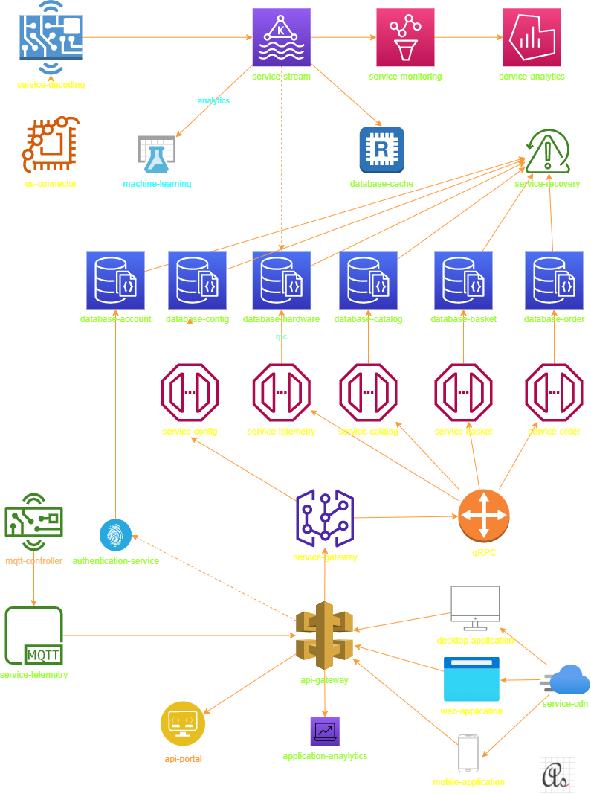

# Architecture diagram.

# 

| order | repository                                                                        |   |
|-------|-----------------------------------------------------------------------------------|---|
|       |                                                                                   |   |
| 101   | com-azmisahin-software-document-service-architecture-ddd-markdown-v1              |   |
| 102   | com-azmisahin-software-tool-test-load-k6-go-v1                                    |   |
|       |                                                                                   |   |
| 201   | com-azmisahin-software-data-service-hardware-mongodb-cplusplus-v1                 |   |
| 202   | com-azmisahin-software-data-service-application-postgresql-c-v1                   |   |
| 203   | com-azmisahin-software-data-service-application-mssql-c-v1                        |   |
| 204   | com-azmisahin-software-data-service-application-cosmosdb-cplusplus-v1             |   |
|       |                                                                                   |   |
| 301   | com-azmisahin-software-data-service-cache-redis-c-v1                              |   |
| 302   | com-azmisahin-software-web-service-stream-kafka-scala-v1                          |   |
| 303   | com-azmisahin-software-web-service-stream-rabbitmq-earlang-v1                     |   |
|       |                                                                                   |   |
| 401   | com-azmisahin-software-web-service-monitor-prometheus-go-v1                       |   |
| 402   | com-azmisahin-software-web-service-analytics-grafana-typescript-v1                |   |
|       |                                                                                   |   |
| 501   | com-azmisahin-software-web-service-gateway-apisix-lua-v1                          |   |
| 502   | com-azmisahin-software-web-service-rest-postgrest-heskell-v1                      |   |
| 503   | com-azmisahin-software-web-service-rpc-grpc-cplusplus-v1                          |   |
| 504   | com-azmisahin-software-web-service-worker-worker-csharp-v1                        |   |
| 505   | com-azmisahin-software-web-service-connector-wcf-csharp-v1                        |   |
|       |                                                                                   |   |
| 601   | com-azmisahin-software-web-api-document-application-markdown-v1                   |   |
| 602   | com-azmisahin-software-web-api-portal-application-typescript-v1                   |   |
| 603   | com-azmisahin-software-web-api-connector-function-javascript-v1                   |   |
| 604   | com-azmisahin-software-web-api-connector-webapi-csharp-v1                         |   |
| 605   | com-azmisahin-software-web-api-connector-function-csharp-v1                       |   |
| 606   | com-azmisahin-software-web-api-connector-function-csharp-v1                       |   |
|       |                                                                                   |   |
| 701   | com-azmisahin-hardware-risc-os-connector-application-c-v1                         |   |
| 702   | com-azmisahin-hardware-web-server-decoding-application-cplusplus-v1               |   |
|       |                                                                                   |   |
| 801   | com-azmisahin-software-web-package-authentication-nodejs-passportjs-javascript-v1 |   |
| 802   | com-azmisahin-software-web-package-sql-connector-nodejs-sqlite-javascript-v1      |   |
| 803   | com-azmisahin-software-web-package-sql-connector-nodejs-knexjs-javascript-v1      |   |
| 804   | com-azmisahin-software-web-package-sql-connector-nodejs-typeorm-typescript-v1     |   |
| 805   | com-azmisahin-software-web-package-sql-connector-nodejs-prisma-javascript-v1      |   |
| 806   | com-azmisahin-software-web-package-remote-procedure-nodejs-grpc-javascript-v1     |   |
|       |                                                                                   |   |
| 901   | com-azmisahin-software-web-site-template-static-html-v1                           |   |
| 902   | com-azmisahin-software-web-site-www-static-html-v1                                |   |
| 903   | com-azmisahin-software-web-site-www-static-angular-html-v1                        |   |
| 904   | com-azmisahin-software-web-site-www-static-reactjs-html-v1                        |   |
| 905   | com-azmisahin-software-web-site-www-static-vuejs-html-v1                          |   |
| 906   | com-azmisahin-software-web-site-www-nodejs-webpack-javascript-v1                  |   |
| 907   | com-azmisahin-software-web-site-www-nodejs-angular-javascript-v1                  |   |
| 908   | com-azmisahin-software-web-site-www-nodejs-reactjs-javascript-v1                  |   |
| 909   | com-azmisahin-software-web-site-www-nodejs-vuejs-javascript-v1                    |   |
| 910   | com-azmisahin-software-web-site-www-nodejs-nuxtjs-javascript-v1                   |   |
| 911   | com-azmisahin-software-web-site-www-nodejs-expressjs-javascript-v1                |   |
| 912   | com-azmisahin-software-web-site-management-nodejs-expressjs-javascript-v1         |   |
| 913   | com-azmisahin-software-web-site-management-nodejs-koajs-javascript-v1             |   |
| 914   | com-azmisahin-software-web-site-management-nodejs-nextjs-javascript-v1            |   |
| 915   | com-azmisahin-software-web-site-management-nodejs-nestjs-typescript-v1            |   |
| 916   | com-azmisahin-software-web-site-management-nodejs-sailsjs-javascript-v1           |   |
| 917   | com-azmisahin-software-web-site-management-asp-vb-v1                              |   |
| 918   | com-azmisahin-software-web-site-management-asp-net-csharp-v1                      |   |
| 919   | com-azmisahin-software-web-site-management-asp-net-core-csharp-v1                 |   |
| 920   | com-azmisahin-software-web-site-management-umbraco-csharp-v1                      |   |
| 921   | com-azmisahin-software-mobile-os-application-cross-nodejs-v1                      |   |
| 922   | com-azmisahin-software-mobile-os-application-ios-objectivec-v1                    |   |
| 923   | com-azmisahin-software-mobile-os-application-ios-swift-v1                         |   |
| 924   | com-azmisahin-software-mobile-os-application-android-kotlin-v1                    |   |
| 925   | com-azmisahin-software-desktop-os-application-cross-nodejs-v1                     |   |
| 926   | com-azmisahin-software-desktop-os-application-windows-csharp-v1                   |   |
| 927   | com-azmisahin-software-desktop-os-application-linux-cplusplus-v1                  |   |
| 928   | com-azmisahin-software-desktop-os-application-macos-cplusplus-v1                  |   |
